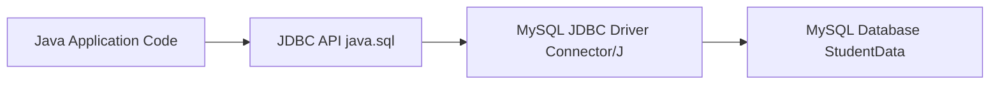

# CP 215 Group Activity 2026 - JDBC Answer Guide

This folder contains a direct implementation of the assignment in the same simple coding style used in `SampleCode/MainApp.java` (constants at top, one `main`, try-with-resources, straightforward output).

## Files in this folder
- `RunCode/StudentData.sql`: SQL script to create `StudentData`, create `Student` and `Course`, and insert sample data.
- `RunCode/WithoutEnv/MainApp.java`: JDBC code with hardcoded DB connection values.
- `RunCode/WithEnv/MainApp.java`: JDBC code with DB connection values from environment variables.
- `RunCode/WithEnv/.env.example`: example environment variable setup.

## Assignment Answers (Task by Task)

### 1. Relationship between Java code, JDBC API, and JDBC Driver


### 2. Requirements needed to use JDBC with a DBMS
1. Java JDK (8+)
2. MySQL Server (8+)
3. MySQL JDBC Driver (`mysql-connector-j` jar)
4. JDBC package (`java.sql.*`, included in JDK)
5. Database credentials (host, port, DB name, username, password)

### 3. JDBC steps and classes/methods used
1. Loading driver
- `Class.forName("com.mysql.cj.jdbc.Driver")`
2. Establishing connection
- `DriverManager.getConnection(...)`
- `Connection` object
3. Creating statement
- `Connection.createStatement()` or `Connection.prepareStatement(...)`
4. Executing SQL
- `Statement.executeQuery(...)`
- `PreparedStatement.executeUpdate()`
- `PreparedStatement.executeBatch()`
5. Processing results and closing
- `ResultSet.next()`, `ResultSet.getString(...)`, `ResultSet.getInt(...)`
- try-with-resources auto closes `Connection`, `Statement`, and `ResultSet`

### 4. Exception handling
- Both Java files use `try-catch` for `ClassNotFoundException` and `SQLException`.
- Batch operations also use rollback (`conn.rollback()`) when needed.

### 5. SQL query requirement
- Database creation is in `RunCode/StudentData.sql`:
  - `CREATE DATABASE StudentData;`
  - `CREATE TABLE Student (...);`
  - `CREATE TABLE Course (...);`
- Java code performs insert/update/retrieve from tables.

### 6. PreparedStatement operations
Both Java versions include:
1. Insert: `preparedInsert(...)`
2. Select: `preparedSelect(...)`
3. Update: `preparedUpdate(...)`
4. Delete: `preparedDelete(...)`

### 7. Batch and dynamic inserts
Both Java versions include:
1. Batch insert: `batchInsertCourses(...)`
2. Batch update: `batchUpdateStudents(...)`
3. Dynamic multiple-row insert: `dynamicInsertStudents(...)`

## How to run

## Step 1: Setup database
```bash
mysql -u root -p < RunCode/StudentData.sql
```

## Step 2: Put MySQL connector jar in classpath
Example jar name:
- `mysql-connector-j-8.4.0.jar`

## Step 3A: Run without environment variables
```bash
cd RunCode/WithoutEnv
javac MainApp.java
java -cp .:/path/to/mysql-connector-j-8.4.0.jar MainApp
```

Edit `USER` and `PASS` in `RunCode/WithoutEnv/MainApp.java` before running.

## Step 3B: Run with environment variables
```bash
cd RunCode/WithEnv
source .env.example
javac MainApp.java
java -cp .:/path/to/mysql-connector-j-8.4.0.jar MainApp
```

You can also set remote DB values by changing `DB_HOST` to an IP address.

## Notes
1. If classpath separator fails on Windows, replace `:` with `;`.
2. If your DB password is different, change `DB_PASS` or the hardcoded `PASS`.
3. The SQL and Java are written for MySQL syntax.
